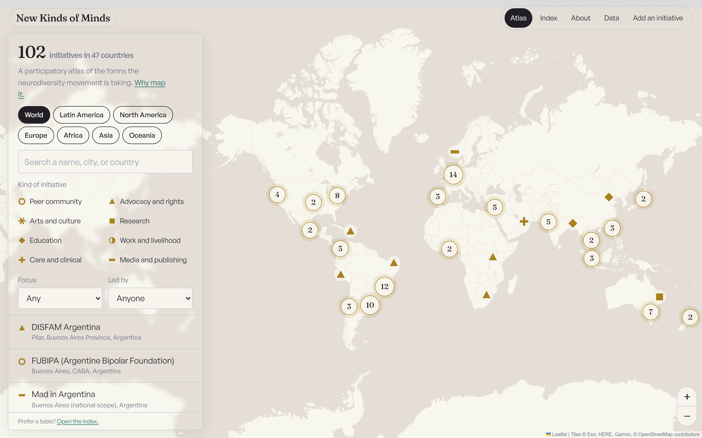
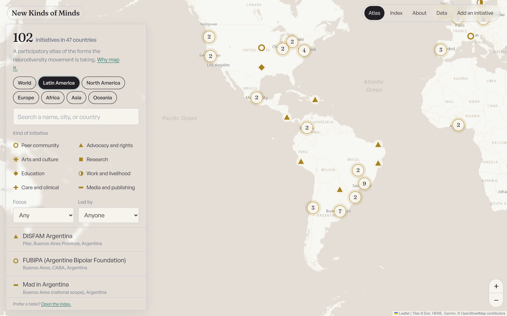
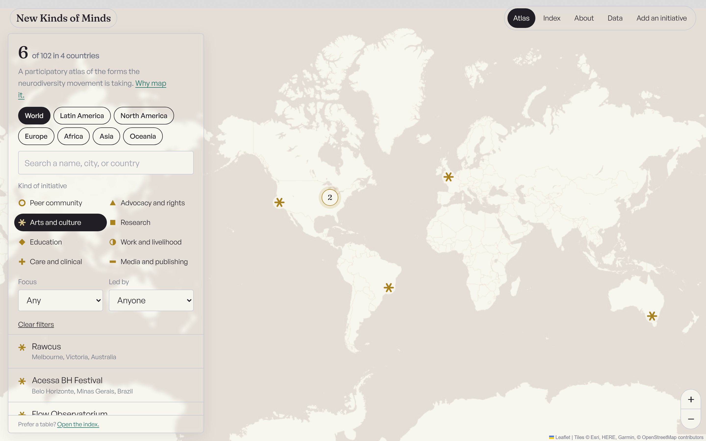

# New Kinds of Minds

**A global atlas of neurodiversity.**

[Explore the live atlas](https://new-kinds-of-minds-hub.vercel.app)



New Kinds of Minds is a participatory map of the organizations, communities, artistic practices, research groups, support networks and alternative institutions through which societies are learning to recognize different kinds of minds.

The atlas is not only a directory. Put enough verified initiatives on one map and patterns begin to appear that no single organization can see from inside: where neurodiversity is chiefly treated as advocacy and where as care; which forms of neurodivergence have built institutions; where initiatives are led by neurodivergent people and where they are created on their behalf; which vocabularies and practices cross borders.

The project is both an information infrastructure and a portrait of a movement in the middle of forming.

## What is here

- `data/seed/*.json` — editable research dataset, one file per research pass, with source URL and verification date for each record
- `data/SCHEMA.md` and `data/TAXONOMY.md` — data model and classification structure
- `data/initiatives.json`, `public/data/initiatives.{json,csv}` — generated validated datasets
- `app/` — Next.js atlas, index, permanent entry pages, About, Data and Contribute interfaces
- `components/` — map, panels, sortable index and contribution interface
- `server/submissions/` — lightweight public-submission queue
- `scripts/pull-submissions.mjs` — review workflow for contributed initiatives

## Views of the atlas

| Regional view | Arts and creative practice filter |
| --- | --- |
|  |  |

## Run it

```bash
npm install
npm run dev
npm run build
```

`npm run dev` regenerates the dataset before starting the application. `npm run build` produces a static export in `out/`.

Optional environment variables:

- `NEXT_PUBLIC_SUBMIT_ENDPOINT` — public submission service URL
- `BASE_PATH` — deployment under a sub-path such as GitHub Pages

## Contribute an initiative

Use the contribution form in the live atlas, or add a record to a file in `data/seed/` and open a pull request.

Every listed initiative must be real and verifiable at its `source_url`. Descriptions are written in plain terms, and leadership is recorded only when an initiative states it publicly.

## Accessibility

The map is only one way into the material. Every initiative is also available through a plain index and permanent entry page.

The interface supports keyboard access through the list and index, respects `prefers-reduced-motion`, uses visible focus states, and targets WCAG AA text contrast. This is an ongoing practice rather than a claim of complete accessibility; professional review remains on the roadmap.

## Roadmap

- Latin America mapping phase with regional contributors
- multilingual interface and summaries in Portuguese, Spanish and English
- versioned dataset releases
- per-record history and correction trails
- project claiming by initiatives themselves
- network relationships between federations and member organizations
- visual and data essays on patterns emerging from the atlas
- professional accessibility review

## Licenses

Code: MIT. Data: CC BY 4.0. Map tiles use OpenFreeMap / OpenMapTiles with OpenStreetMap contributors.

## Lineage

New Kinds of Minds is a project by [Daniel Rezinovsky](https://danielrezinovsky.com), developed within the wider [Monkadelic](https://monkadelic.me) research and creative ecosystem.

It grew out of [Entrementes](https://danrezi-gif.github.io/Entrementes/). The name *New Kinds of Minds* has covered Daniel's broader work on unusual minds and non-standard human trajectories since 2019; the atlas is its first public instrument.